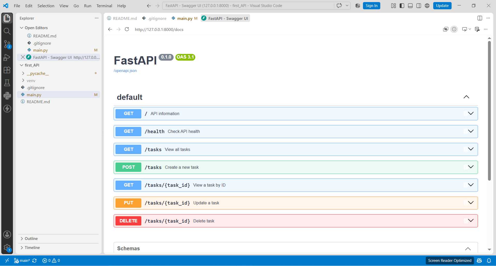
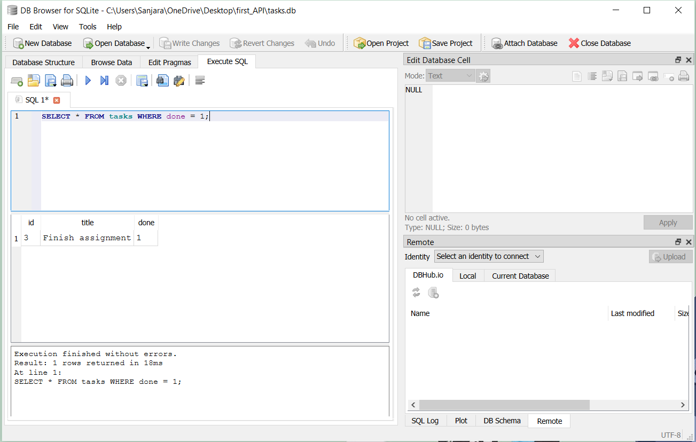

# Task API

A small CRUD API for managing a to-do list, built with FastAPI. Data is stored persistently in Postgres, running in Docker alongside the app itself.

## What this is

This API lets you manage a list of tasks through HTTP requests. It was built as part of the FlyRank AI internship Assignment BE-01 (CRUD basics), W3 · A1 (SQLite persistence), and the Postgres/Docker assignment that followed to practice CRUD, the separation between an API and its storage layer, and running a full app + database stack with one command.

## How to run (Docker - recommended)

```bash
git clone https://github.com/SanjaraT/first_API
cd first_API
cp .env.example .env   # then fill in your own values if needed
docker compose up
```

This starts both the API and a Postgres database together. The API is available at `http://localhost:8000`, with interactive docs at `http://localhost:8000/docs`.

## How to run (without Docker)

```bash
python -m venv venv
venv\Scripts\activate        # Windows
# source venv/bin/activate   # Mac/Linux
pip install -r requirements.txt
uvicorn main:app --reload
```

Requires a running Postgres instance and a `.env` file with a valid `DATABASE_URL` (see `.env.example`).

## Architecture

The project is split into two layers:

- **`main.py`** - the API layer. Defines routes, handles HTTP status codes and input validation.
- **`repository.py`** - the data layer. Every database operation (create, read, update, delete) lives here, with no knowledge of HTTP at all.

Routes call the repository; they never talk to the database directly. This means the entire storage backend was swapped from an in-memory list, to SQLite, to Postgres across this project's history and `main.py`'s routes never changed. Only `repository.py` changed each time.

## Database

- **Where it runs:** Postgres, in its own Docker container, defined in `docker-compose.yml`.
- **Persistence:** the container uses a named Docker volume (`pgdata`), so data survives both app restarts and full container restarts  it is not lost when `docker compose down` (without `-v`) is run.
- **Connection string:** read from `.env` (gitignored). A `.env.example` with placeholder values is committed instead, so the required variables are documented without exposing real credentials.
- **Table creation:** the `tasks` table and its 3 seed rows are created automatically on first startup, the same as in the SQLite version — nothing needs to be created manually.

## Endpoints

| Method | Path            | Description                     | Success | Errors                     |
|--------|-----------------|----------------------------------|---------|-----------------------------|
| GET    | `/`             | API info                        | 200     | —                           |
| GET    | `/health`       | Health check                    | 200     | —                           |
| GET    | `/tasks`        | List all tasks                  | 200     | —                           |
| GET    | `/tasks/{id}`   | Get a single task                | 200     | 404 if id not found        |
| POST   | `/tasks`        | Create a new task                | 201     | 400 if title missing/empty |
| PUT    | `/tasks/{id}`   | Update a task's title and/or done| 200     | 400 invalid body · 404 unknown id |
| DELETE | `/tasks/{id}`   | Delete a task                    | 204     | 404 if id not found        |

## Example request

```bash
Invoke-WebRequest -Uri http://localhost:8000/tasks -Method POST -Headers @{"Content-Type"="application/json"} -Body '{"title":"Buy milk"}'
```

```
StatusCode        : 201
StatusDescription : Created
Content           : {"id":4,"title":"Buy milk","done":false}
RawContent        : HTTP/1.1 201 Created
                    Content-Length: 40
                    Content-Type: application/json
                    Date: Wed, 26 Aug 2026 13:27:04 GMT
                    Server: uvicorn
                    
                    {"id":4,"title":"Buy milk","done":false}
Images            : {}
InputFields       : {}
Links             : {}
ParsedHtml        : mshtml.HTMLDocumentClass
RawContentLength  : 40
```

## Swagger UI

The full CRUD cycle was tested via `/docs` using "Try it out" for each endpoint.



## Proving persistence across a restart

1. Started the stack with `docker compose up` and created several tasks via Swagger.
2. Stopped everything with `docker compose down` (without `-v`, so the `pgdata` volume was preserved).
3. Restarted with `docker compose up`.
4. Called `GET /tasks` again  all previously created tasks were still present, confirming the database volume survives a full app + container restart, not just an app-only restart.

## Exploring the database directly

Opened `tasks.db` in DB Browser for SQLite and ran queries directly against the table, confirming the API reflects manual database changes immediately. Example query:

```sql
SELECT * FROM tasks WHERE done = 1;
```



## Notes

- The project's storage backend evolved in three stages: an in-memory Python list → SQLite (`tasks.db`) → Postgres in Docker. At every stage, only `repository.py` changed; `main.py`'s routes and their behavior stayed identical  this is the repository pattern proving itself in practice, not just in theory.
- `.env` is gitignored; only `.env.example` (with placeholder values) is committed.